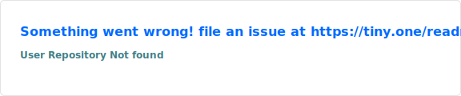

# bonjour 🐻‍❄️

I work at [Datadog](https://www.datadoghq.com/). I used to work at [Liferay](https://www.liferay.com/). I like open source stuff. I like to help.

Because of all of the above, you'll find many repositories to help Datadog and Liferay enthusiasts.

---

> _awesome cards made possible by [@anuraghazra](https://github.com/anuraghazra)_
